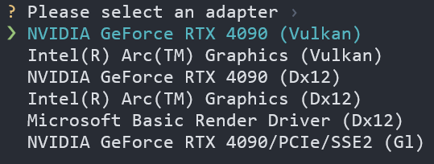

<div align="center">

<h1> RWKV Inference Performance Testing Guide </h1>

[](./README.md)
[](./README_EN.md)

</div>

This guide will help you configure and test the inference performance of the RWKV model on your local device.  
We invite you to [submit issues](https://github.com/RWKV-Vibe/RWKV-Inference-Performance-Test/issues) to share your RWKV inference performance results.

> [!NOTE]
> To maintain consistency, we only accept performance test data based on the **RWKV7-G1 2.9B** model as the benchmark, but various quantization types such as FP16, Q8/INT8, and Q4/INF4 are allowed.

## Introduction to Test Methods

We provide testing methods based on three different inference tools: [web-rwkv testing](#web-rwkv-testing) | [RWKV pip testing](#rwkv-pip-testing) | [llama.cpp testing](#llamacpp-testing).

|Testing Method|Required Model Format|Supported GPU Types|
|---|---|---|
|web-rwkv|`.st`|All GPUs supporting vulkan, including integrated graphics|
|RWKV pip|`.pth`|NVIDIA GPUs supporting CUDA (CPU mode available but not recommended for testing)|
|llama.cpp|`.gguf`|All types of GPUs, including integrated graphics and CPU|

Before starting, please ensure you have the following:

- Sufficient storage space for downloading model files
- Basic command line operation skills
- Python environment installed (required for RWKV pip testing)

## web-rwkv testing

### Test Preparation

1. Download web-rwkv tool: Visit [web-rwkv releases](https://github.com/cryscan/web-rwkv/releases) page, download the latest version suitable for your operating system, and extract it in an empty directory
2. Get RWKV7-G1 2.9B model: [Click to download](https://huggingface.co/shoumenchougou/RWKV-ST-model/resolve/main/rwkv7-g1-2.9b-20250519-ctx4096.st?download=true) `rwkv7-g1-2.9b-20250519-ctx4096.st` RWKV model file for performance testing
3. Move the downloaded model file to the `dist` folder in the web-rwkv extracted directory

### Inference Performance Testing

In the `web-rwkv/dist` directory, right-click and select "Open in Integrated Terminal". Then execute the following commands for testing different quantization precisions:

1. fp16 precision inference performance test:

```bash
./bench.exe --model "./rwkv7-g1-2.9b-20250519-ctx4096.st"
```
2. INT8 quantization inference performance test:
```bash
./bench.exe --model "./rwkv7-g1-2.9b-20250519-ctx4096.st" --quant 31
```
3. NF4 quantization inference performance test:
```bash
./bench.exe --model "./rwkv7-g1-2.9b-20250519-ctx4096.st" --quant-nf4 31
```

>[!WARNING]
> `--quant` and `--quant-nf4` are quantization layers, recommended to keep the default value `31`

**Move the cursor and select your inference device (recommended to use the default `vulkan` backend)**



After testing, the terminal will output a performance report in the following format:

```
| model                                                    | quant_int8 | quant_float4 |    test |            t/s |
|----------------------------------------------------------|-----------:|-------------:|--------:|---------------:|
| rwkv7-g1-2.9b-20250519-ctx4096.st                        |          0 |            0 |   pp512 |        1022.89 |
| rwkv7-g1-2.9b-20250519-ctx4096.st                        |          0 |            0 |   tg128 |          95.98 |
```

Where **t/s** represents inference speed (tokens/second). Please copy this performance table from the terminal, paste it into a [new web-rwkv-performance-report issue](https://github.com/RWKV-Vibe/RWKV-Inference-Performance-Test/issues/new?template=web-rwkv-performance-report.md), and provide your **CPU and GPU model**.

---

## RWKV pip testing

Test performance data by calling the [RWKV pip repository](https://pypi.org/project/rwkv/) through Python code for inference.

To test based on RWKV pip, you need to download a RWKV7-G1 2.9B model in `.pth` format first:

- [ModelScope Download](https://modelscope.cn/models/RWKV/rwkv7-g1/resolve/master/rwkv7-g1-2.9b-20250519-ctx4096.pth)
- [Hugging Face Download](https://huggingface.co/BlinkDL/rwkv7-g1/resolve/main/rwkv7-g1-2.9b-20250519-ctx4096.pth?download=true)

### Preparing Test Environment

> [!TIP]
> Recommended to use [AnaConda](https://anaconda.org/anaconda/conda) for Python environment management

Run the following commands to create a new conda environment, install necessary Python packages, and clone this repository:

```bash
conda create -n rwkv-pip-test python=3.12
conda activate rwkv-pip-test
pip install torch --upgrade --extra-index-url https://download.pytorch.org/whl/cu128
pip install rwkv psutil prompt_toolkit tokenizers
git clone https://github.com/ehooon/RWKV-Inference-Performance-Test.git
```

### Testing Inference Performance

Open `rwkv-pip-test.py` file and edit the key parameters:

| Parameter Name | Function Description | Available Values | Notes |
|---------|---------|--------|------|
| `args.strategy` | Running device and precision | `cuda fp16`<br>`cpu fp16`<br>`cuda fp32` | Recommended to use `cuda fp16` |
| `args.MODEL_NAME` | Model file path | Complete path to model file | Only needs `.pth` model name, without file extension |

**Configuration Example:**

```python
args.strategy = 'cuda fp16'
args.MODEL_NAME = '/path/to/your/rwkv-model'
```

After configuration, run the following command in terminal to start the test script:

```bash
python rwkv-pip-test.py
```

After program startup, you can interact with the model through an interactive chat interface. After each round of dialogue, the terminal will display the model's inference speed and VRAM usage. Such as

```
────────────────────────────────────────────────────────────
[Current Generation]: 111 tokens | Time: 4.69s | Speed: 23.66 tokens/s
[Total Statistics]: 582 tokens | Average Speed: 22.48 tokens/s
[Current VRAM Usage]: 5.52GB/23.99GB (23.0%) | Cache: 5.75GB
GPU cache cleared
────────────────────────────────────────────────────────────
```

Please copy the performance data from the terminal, paste it into a [new RWKV pip performance-report issue](https://github.com/RWKV-Vibe/RWKV-Inference-Performance-Test/issues/new?template=rwkv-pip-performance-report.md), and provide your **CPU and GPU model**.

>[!WARNING]
> Please record the performance data from the second or third round of dialogue to eliminate interference.

## llama.cpp testing

Use llama.cpp's `llama-bench` to test performance. You need to download RWKV models in `.gguf` format in advance:

- ModelScope download: [rwkv7-2.9B-g1-F16.gguf](https://modelscope.cn/models/zhiyuan8/RWKV-v7-2.9B-G1-GGUF/resolve/master/rwkv7-2.9B-g1-F16.gguf) | [rwkv7-2.9B-g1-Q8_0.gguf](https://modelscope.cn/models/zhiyuan8/RWKV-v7-2.9B-G1-GGUF/resolve/master/rwkv7-2.9B-g1-Q8_0.gguf)
- Hugging Face download: [rwkv7-2.9B-g1-F16.gguf](https://huggingface.co/zhiyuan8/RWKV-v7-2.9B-G1-GGUF/resolve/main/rwkv7-2.9B-g1-F16.gguf?download=true) | [rwkv7-2.9B-g1-Q8_0.gguf](https://huggingface.co/zhiyuan8/RWKV-v7-2.9B-G1-GGUF/resolve/main/rwkv7-2.9B-g1-Q8_0.gguf?download=true)

### Download or Build llama.cpp

You can choose to download pre-compiled llama.cpp programs from the [llama.cpp releases page](https://github.com/ggml-org/llama.cpp/releases).

llama.cpp provides various pre-compiled versions. Choose the appropriate version based on your operating system and graphics card type:

| System Type | GPU Type | Package Name Field |
|-------------|----------|-------------------|
| macOS | Apple Silicon | macos-arm64.zip |
| Windows | Intel GPU (including Arc discrete/Xe integrated) | win-sycl-x64.zip |
| Windows | NVIDIA GPU (CUDA 11.7-12.3) | win-cuda-cu11.7-x64.zip |
| Windows | NVIDIA GPU (CUDA 12.4+) | win-cuda-cu12.4-x64.zip |
| Windows | AMD and other GPUs (including AMD integrated) | win-vulkan-x64.zip |
| Windows | No GPU | win-openblas-x64.zip |

For Linux systems and other unlisted system and hardware combinations, it's recommended to refer to the [llama.cpp build documentation](https://github.com/ggerganov/llama.cpp/blob/master/docs/build.md) and choose the appropriate method for local compilation and building.

### Inference Performance Testing

Start a terminal and navigate to the llama.cpp directory, then use the following command `llama-bench` to run the performance test script:

```
./build/bin/llama-bench -m /path/to/your/models/rwkv7-g1-2.9b.gguf 
```

You will see output like this in the terminal:

```
ggml_cuda_init: GGML_CUDA_FORCE_MMQ:    no
ggml_cuda_init: GGML_CUDA_FORCE_CUBLAS: no
ggml_cuda_init: found 2 CUDA devices:
  Device 0: NVIDIA GeForce RTX 5090, compute capability 12.0, VMM: yes
  Device 1: NVIDIA GeForce RTX 5090, compute capability 12.0, VMM: yes
| model                          |       size |     params | backend    | ngl |            test |                  t/s |
| ------------------------------ | ---------: | ---------: | ---------- | --: | --------------: | -------------------: |
| rwkv7 2.9B F16                 |   5.52 GiB |     2.95 B | CUDA       |  99 |           pp512 |     12004.34 ± 21.47 |
| rwkv7 2.9B F16                 |   5.52 GiB |     2.95 B | CUDA       |  99 |           tg128 |         83.01 ± 1.54 |

build: d17a809e (5600)
```

Please copy this performance data from the terminal, paste it into a [new llama.cpp performance report issue](https://github.com/RWKV-Vibe/RWKV-Inference-Performance-Test/issues/new?template=llama-cpp-performance-report.md), and provide your **CPU model**.

## 🙏 Acknowledgments

Thanks to the following developers and projects for supporting this guide:

- [@BlinkDL](https://github.com/BlinkDL) - RWKV architecture author
- [@cryscan](https://github.com/cryscan) - Developer of [web-rwkv](https://github.com/cryscan/web-rwkv) project

Special thanks to all contributors in the RWKV open source community for enabling this excellent language model architecture to continuously develop and improve.

---

*This guide is continuously being updated. If you have any questions or suggestions, please feel free to submit an Issue or Pull Request.*