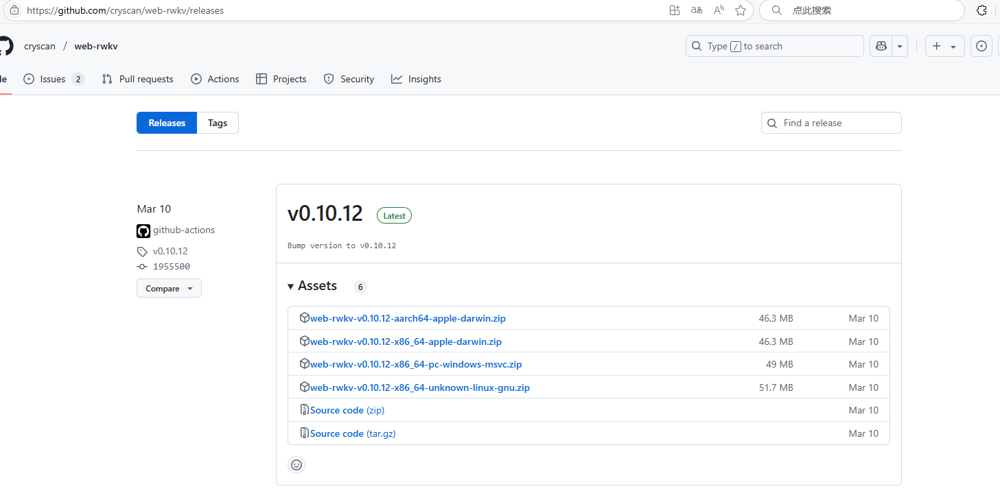
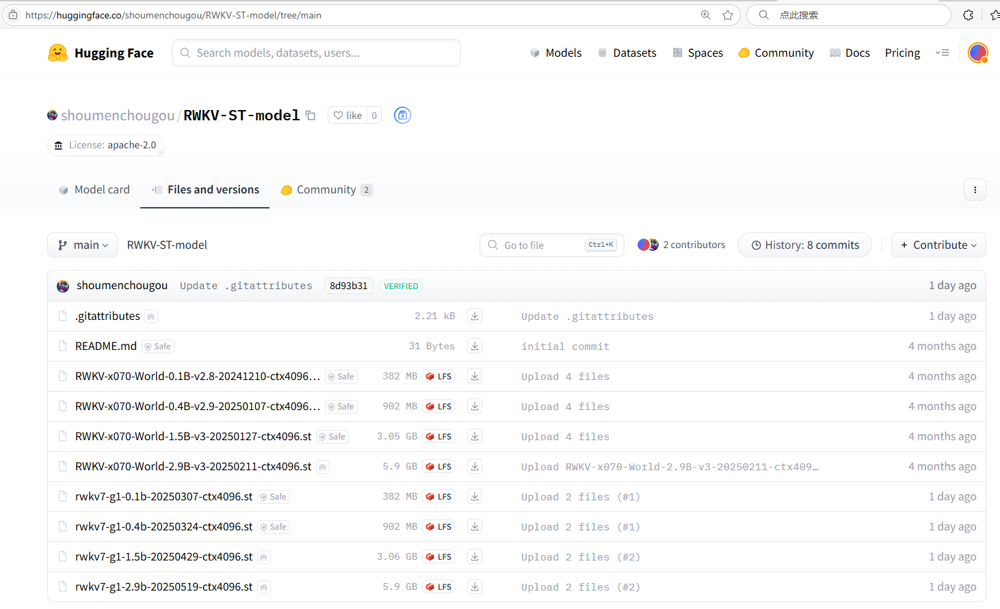
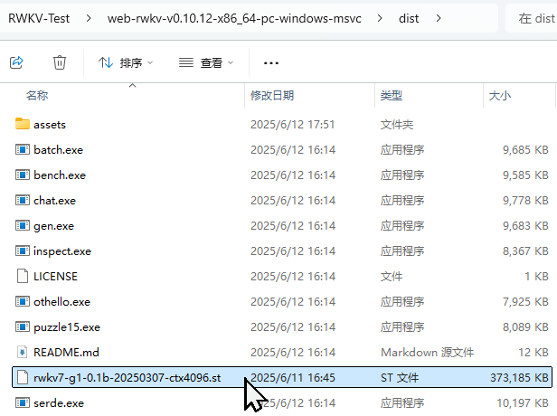
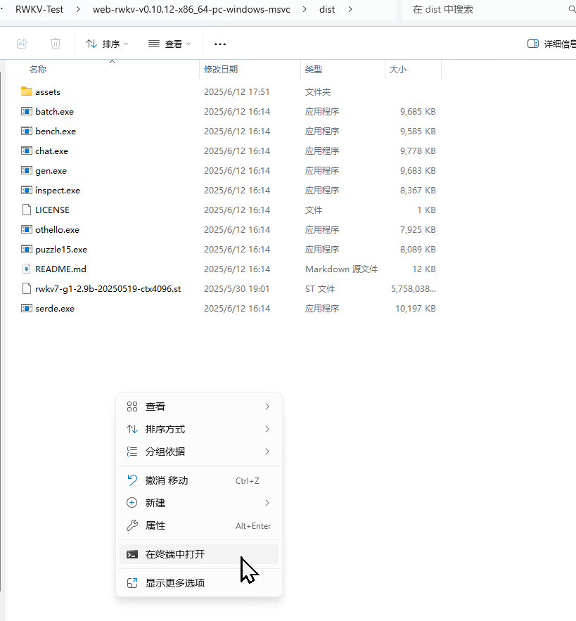
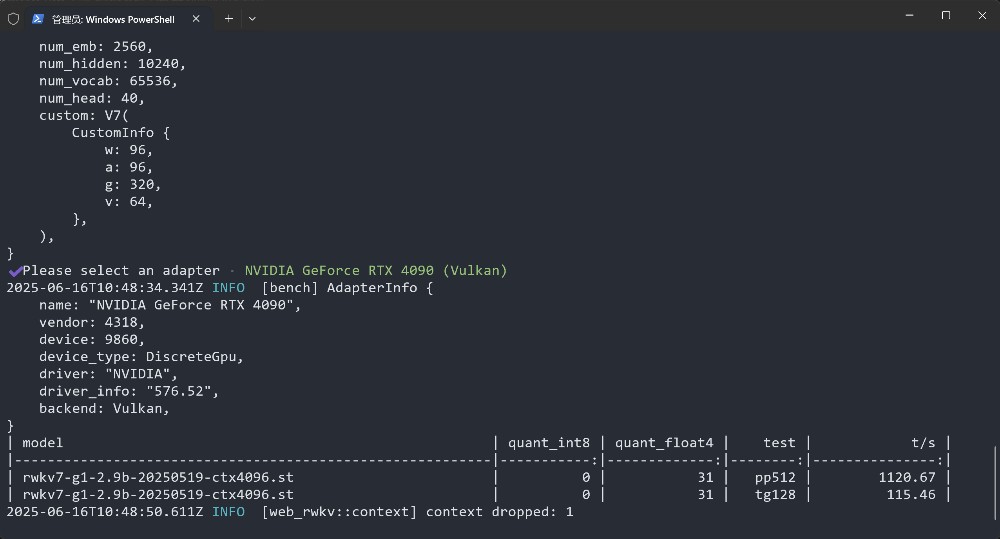
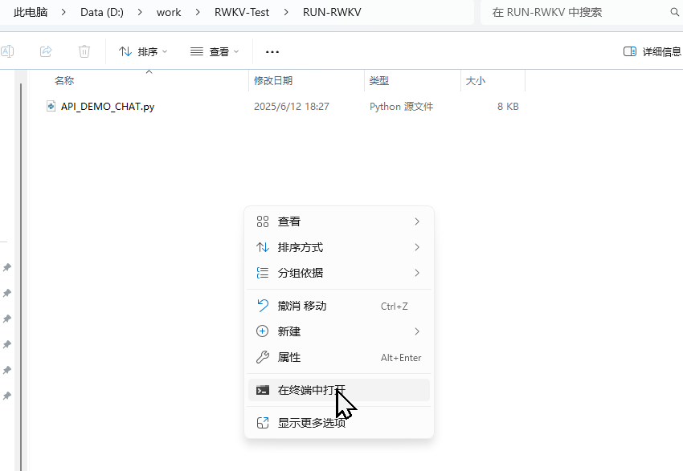

# RWKV Inference Performance Testing Guide

**Language / 语言:** [🇨🇳 中文](./readme.md) | 🇺🇸 English

This guide will help you quickly set up and test the inference performance of RWKV models, providing two different testing approaches.

## 📋 Table of Contents

- [Prerequisites](#prerequisites)
- [Test 1: web-rwkv Performance Benchmark](#🔧-test-1-web-rwkv-performance-benchmark)
  - [Installation Steps](#📦-installation-steps)
  - [Performance Testing](#⚡-performance-testing)
  - [Understanding Test Results](#📊-understanding-test-results)
- [Test 2: RWKVpip Interactive Testing](#🐍-test-2-rwkvpip-interactive-testing)
  - [Environment Setup](#📋-environment-setup)
  - [Configuration and Execution](#⚙️-configuration-and-execution)
- [Important Notes](#⚠️-important-notes)

## 🚀 Prerequisites

Before getting started, ensure that:

- Your system has sufficient storage space for downloading model files
- You have basic command-line operation skills
- Python environment is installed (required for Test 2)

## 🔧 Test 1: web-rwkv Performance Benchmark

### 📦 Installation Steps

#### 1. Download web-rwkv Tool

Visit the [web-rwkv releases](https://github.com/cryscan/web-rwkv/releases) page and download the latest version package suitable for your operating system.



After downloading, extract the package to your chosen directory.

#### 2. Obtain RWKV Model

Go to the [RWKV-ST-model](https://huggingface.co/shoumenchougou/RWKV-ST-model/tree/main) repository and download the required RWKV model files in `.st` format.



#### 3. Configure Model Path

Move the downloaded model files to the `dist` folder within the web-rwkv extracted directory:



### ⚡ Performance Testing

#### Open Terminal

First, navigate to the `dist` directory of the extracted folder, right-click and select "Open in integrated terminal":



Then enter the following commands to test different quantization levels:

#### Basic Test (No Quantization)

Run the following command for basic performance testing:

```bash
./bench.exe --model "path-to/rwkv7-g1-2.9b-20250519-ctx4096.st"
```

#### INT8 Quantization Test

Using INT8 quantization can reduce memory usage and improve inference speed:

```bash
./bench.exe --model "path-to/rwkv7-g1-2.9b-20250519-ctx4096.st" --quant 31
```

**Parameter Description:**

- `--quant`: Sets the number of quantization layers, higher values mean more aggressive quantization

#### NF4 Quantization Test

NF4 quantization provides more aggressive compression options:

```bash
./bench.exe --model "path-to/rwkv7-g1-2.9b-20250519-ctx4096.st" --quant-nf4 31
```

### 📊 Understanding Test Results

After testing is complete, you will see a performance report containing the following information:



**Result Explanation:**

- **t/s**: Represents inference speed (tokens/second), higher values indicate better performance
- **Other columns**: Contains basic model information such as model name, INT8 quantization layers, NF4 quantization layers, and test content

This data will help you evaluate the performance of RWKV models under different quantization settings and choose the configuration that best suits your needs.

## 🐍 Test 2: RWKVpip Interactive Testing

This method is suitable for users who want to test model performance directly through Python code.

### 📋 Environment Setup

#### 1. Open Terminal

In the same directory as the `API_DEMO_CHAT.py` file, right-click and select "Open in terminal":



#### 2. Install Dependencies

Run the following commands to install necessary Python packages:

```bash
# Install PyTorch (supporting CUDA 12.1)
pip install torch --upgrade --extra-index-url https://download.pytorch.org/whl/cu121

# Install RWKV related dependencies
pip install rwkv psutil prompt_toolkit tokenizers
```

### ⚙️ Configuration and Execution

#### 3. Parameter Configuration

In the `API_DEMO_CHAT.py` file, you need to adjust the following key parameters:

| Parameter Name | Function Description | Optional Values | Notes |
|---------------|---------------------|-----------------|-------|
| `args.strategy` | Runtime device and precision | `cuda fp16`<br>`cpu fp16`<br>`cuda fp32` | Recommended to use `cuda fp16` for best performance |
| `args.MODEL_NAME` | Model file path | Complete path to model file | Only need to input model name without suffix, but requires `.pth` format model here |

**Configuration Example:**

```python
args.strategy = 'cuda fp16'  # Use GPU and half-precision floating point
args.MODEL_NAME = '/path/to/your/rwkv-model'
```

#### 4. Start Testing

After configuration, run the following command in the terminal to start the model:

```bash
python API_DEMO_CHAT.py
```

Once the program starts, you can test the model's response speed and quality through the interactive chat interface.

## ⚠️ Important Notes

- **Path Format**: Model paths in commands must retain quotation marks
- **Quantization Limits**: Number of quantization layers cannot exceed the actual layers of the model
- **File Paths**: Please adjust path parameters according to the actual model file location
- **GPU Support**: Test 2 requires CUDA support for optimal performance
- **Model Formats**: The two methods support different model formats (`.st` vs `.pth`)

## 🙏 Acknowledgments

Thanks to the following developers and projects for their support to this guide:

- [@BlinkDL](https://github.com/BlinkDL) - Creator of the RWKV architecture
- [@cryscan](https://github.com/cryscan) - Developer of the [web-rwkv](https://github.com/cryscan/web-rwkv) project
- [@shoumenchougou](https://github.com/shoumenchougou) - Provider of the pre-trained model repository

Special thanks to all contributors in the RWKV open-source community for their continuous development and improvement of this excellent language model architecture.

---

*This guide is continuously updated. If you have questions or suggestions, please feel free to submit an Issue or Pull Request.*