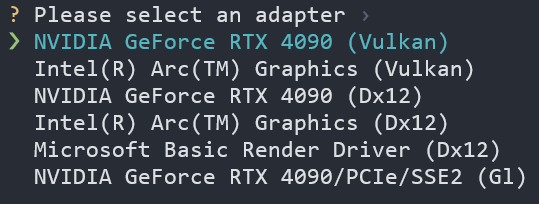

<div align="center">

<h1> RWKV 推理性能测试指南 </h1>

[](./README.md)
[](./README_EN.md)

</div>

本指南将帮助您在本地设备上配置并测试 RWKV 模型的推理性能，我们也欢迎您[提交 issue](https://github.com/RWKV-Vibe/RWKV-Inference-Performance-Test/issues) 报告 RWKV 模型在您设备上的推理性能数据。

> [!NOTE]
> 为确保数据一致性，我们仅接受基于 **RWKV7-G1 2.9B** 模型的性能测试数据，但支持不同的量化类型，如 FP16、Q8/INT8、Q4/INF4 等。

## 测试方法介绍

我们提供了基于三种不同推理工具的测试方法：[web-rwkv 测试](#web-rwkv-测试) | [RWKV pip 测试](#rwkv-pip-测试) | [llama.cpp 测试](#llamacpp-测试)。

|测试方法|需要的模型格式|支持的显卡类型|
|---|---|---|
|web-rwkv|`.st`|支持 vulkan 的所有显卡，包括核显|
|RWKV pip|`.pth`|支持 CUDA 的 NVIDIA 显卡，虽然有 CPU 模式，但不建议测试|
|llama.cpp|`.gguf` | 所有类型的显卡，包括核显和 CPU |

在开始之前，请确保您具备以下条件：

- 系统具备足够的存储空间用于下载模型文件
- 具备基本的命令行操作能力
- 已安装 Python 环境（RWKV pip 测试需要）

## web-rwkv 测试

### 测试准备

1. 下载 web-rwkv 工具：访问 [web-rwkv releases](https://github.com/cryscan/web-rwkv/releases) 页面，下载适合您操作系统的最新版本压缩包，在一个空白目录中解压
2. 获取 RWKV7-G1 2.9B 模型：[点击下载](https://huggingface.co/shoumenchougou/RWKV-ST-model/resolve/main/rwkv7-g1-2.9b-20250519-ctx4096.st?download=true) `rwkv7-g1-2.9b-20250519-ctx4096.st` RWKV 模型文件，用于性能测试
3. 将下载的模型文件移动到 web-rwkv 解压目录下的 `dist` 文件夹中

### 推理性能测试

在 `web-rwkv/dist` 目录下，右键选择"在集成终端中打开"。然后分别执行入以下指令，进行不同量化精度的测试：

1. fp16 精度推理性能测试：

```bash
./bench.exe --model "./rwkv7-g1-2.9b-20250519-ctx4096.st"
```
2. INT8 量化推理性能测试：
```bash
./bench.exe --model "./rwkv7-g1-2.9b-20250519-ctx4096.st" --quant 31
```
3. NF4 量化推理性能测试
```bash
./bench.exe --model "./rwkv7-g1-2.9b-20250519-ctx4096.st" --quant-nf4 31
```

>[!WARNING]
> `--quant` 和 `--quant-nf4` 是量化层数，推荐保持默认值 `31`

**移动光标并选择您的推理设备（推荐使用默认的 `vulkan` 后端）**



测试完成后，终端将输出如下格式的性能报告：

```
| model                                                    | quant_int8 | quant_float4 |    test |            t/s |
|----------------------------------------------------------|-----------:|-------------:|--------:|---------------:|
| rwkv7-g1-2.9b-20250519-ctx4096.st                        |          0 |            0 |   pp512 |        1022.89 |
| rwkv7-g1-2.9b-20250519-ctx4096.st                        |          0 |            0 |   tg128 |          95.98 |
```

请将从终端复制此表格，将其粘贴到[新的 web-rwkv 性能报告 issue](https://github.com/RWKV-Vibe/RWKV-Inference-Performance-Test/issues/new?template=web-rwkv-performance-report.md) 中，并提供您的 **CPU 和 GPU 型号**。

---

## RWKV pip 测试

通过 Python 代码调用 [RWKV pip 仓库](https://pypi.org/project/rwkv/)进行推理，以测试性能数据。

要基于 RWKV pip 测试，需要提前下载一个 `.pth` 格式的 RWKV7-G1 2.9B 模型：

- [魔搭平台下载](https://modelscope.cn/models/RWKV/rwkv7-g1/resolve/master/rwkv7-g1-2.9b-20250519-ctx4096.pth)
- [Hugging Face 下载](https://huggingface.co/BlinkDL/rwkv7-g1/resolve/main/rwkv7-g1-2.9b-20250519-ctx4096.pth?download=true)

### 准备测试环境

> [!TIP]
> 推荐使用 [AnaConda](https://anaconda.org/anaconda/conda) 管理 Python 环境

运行以下命令新建一个 conda 环境，安装必要的 Python 环境，然后克隆此仓库：

```bash
conda create -n rwkv-pip-test python=3.12
conda activate rwkv-pip-test
pip install torch --upgrade --extra-index-url https://download.pytorch.org/whl/cu128
pip install rwkv psutil prompt_toolkit tokenizers
git clone https://github.com/ehooon/RWKV-Inference-Performance-Test.git
```

### 测试推理性能

打开 `rwkv-pip-test.py` 文件，编辑中的关键参数：

| 参数名称 | 功能描述 | 可选值 | 说明 |
|---------|---------|--------|------|
| `args.strategy` | 运行设备和精度 | `cuda fp16`<br>`cpu fp16`<br>`cuda fp32` | 推荐使用 `cuda fp16`  |
| `args.MODEL_NAME` | 模型文件路径 | 模型文件的完整路径 | 仅需要`.pth` 模型名称，不需要文件后缀 |

**配置示例：**

```python
args.strategy = 'cuda fp16'
args.MODEL_NAME = '/path/to/your/rwkv-model'
```

配置完成后，在终端中运行以下命令启动测试脚本：

```bash
python rwkv-pip-test.py
``` 

程序启动后，您可以通过交互式聊天界面与模型对话。每轮对话过后，终端会显示模型的响应速度和显存占用。

```
────────────────────────────────────────────────────────────
[Current Generation]: 111 tokens | Time: 4.69s | Speed: 23.66 tokens/s
[Total Statistics]: 582 tokens | Average Speed: 22.48 tokens/s
[Current VRAM Usage]: 5.52GB/23.99GB (23.0%) | Cache: 5.75GB
GPU cache cleared
────────────────────────────────────────────────────────────
```

请将从终端复制性能数据，将其粘贴到[新的 RWKV pip 性能报告 issue](https://github.com/RWKV-Vibe/RWKV-Inference-Performance-Test/issues/new?template=rwkv-pip-performance-report.md) 中，并提供您的 **CPU 和 GPU 型号**。

>[!WARNING]
> 请记录第二轮或第三轮对话的性能数据，以排除干扰。

## llama.cpp 测试

使用 llama.cpp 的 `llama-bench` 测试性能。需要下载提前下载 `.gguf` 格式的 RWKV 模型：

- 魔搭平台下载：下载：[rwkv7-2.9B-g1-F16.gguf](https://modelscope.cn/models/zhiyuan8/RWKV-v7-2.9B-G1-GGUF/resolve/master/rwkv7-2.9B-g1-F16.gguf) | [rwkv7-2.9B-g1-Q8_0.gguf](https://modelscope.cn/models/zhiyuan8/RWKV-v7-2.9B-G1-GGUF/resolve/master/rwkv7-2.9B-g1-Q8_0.gguf)
- Hugging Face 下载：[rwkv7-2.9B-g1-F16.gguf](https://huggingface.co/zhiyuan8/RWKV-v7-2.9B-G1-GGUF/resolve/main/rwkv7-2.9B-g1-F16.gguf?download=true) | [rwkv7-2.9B-g1-Q8_0.gguf](https://huggingface.co/zhiyuan8/RWKV-v7-2.9B-G1-GGUF/resolve/main/rwkv7-2.9B-g1-Q8_0.gguf?download=true)

### 下载或编译 llama.cpp 

可以选择从 [llama.cpp 的 release 页面](https://github.com/ggml-org/llama.cpp/releases)下载预编译的 llama.cpp 程序。

llama.cpp 提供了多种预编译版本，根据你的操作系统和显卡类型选择合适的版本：

| 系统类型 | GPU 类型 | 包名称字段 |
|----------|----------|------------|
| macOS | 苹果芯片 | macos-arm64.zip |
| Windows | 英特尔 GPU（含 Arc 独显/Xe 核显） | win-sycl-x64.zip |
| Windows | 英伟达 GPU（CUDA 11.7-12.3） | win-cuda-cu11.7-x64.zip |
| Windows | 英伟达 GPU（CUDA 12.4+） | win-cuda-cu12.4-x64.zip |
| Windows | AMD 和其他 GPU（含 AMD 核显） | win-vulkan-x64.zip |
| Windows | 无 GPU | win-openblas-x64.zip |

Linux 系统和其他未列出的系统与硬件组合，建议参照 [llama.cpp 官方构建文档](https://github.com/ggerganov/llama.cpp/blob/master/docs/build.md)，选择适合的方法本地编译构建。

### 推理性能测试

启动终端并导航到 llama.cpp 目录，使用以下命令 `llama.bench` 运行性能测试脚本：

```
./build/bin/llama-bench -m /pth/to/your/models/rwkv7-g1-2.9b.gguf 
```

您将在终端看到如下输入：

```
ggml_cuda_init: GGML_CUDA_FORCE_MMQ:    no
ggml_cuda_init: GGML_CUDA_FORCE_CUBLAS: no
ggml_cuda_init: found 2 CUDA devices:
  Device 0: NVIDIA GeForce RTX 5090, compute capability 12.0, VMM: yes
  Device 1: NVIDIA GeForce RTX 5090, compute capability 12.0, VMM: yes
| model                          |       size |     params | backend    | ngl |            test |                  t/s |
| ------------------------------ | ---------: | ---------: | ---------- | --: | --------------: | -------------------: |
| rwkv7 2.9B F16                 |   5.52 GiB |     2.95 B | CUDA       |  99 |           pp512 |     12004.34 ± 21.47 |
| rwkv7 2.9B F16                 |   5.52 GiB |     2.95 B | CUDA       |  99 |           tg128 |         83.01 ± 1.54 |

build: d17a809e (5600)
```

请将从终端复制此性能数据，将其粘贴到[新的 llama.cpp 性能报告 issue](https://github.com/RWKV-Vibe/RWKV-Inference-Performance-Test/issues/new?template=llama-cpp-performance-report.md) 中，并提供您的 **CPU 型号**。

## 🙏 致谢

感谢以下开发者和项目为本指南提供的支持：

- [@BlinkDL](https://github.com/BlinkDL) - [RWKV-LM](https://github.com/BlinkDL/RWKV-LM) 作者
- [@cryscan](https://github.com/cryscan) - [web-rwkv](https://github.com/cryscan/web-rwkv) 项目作者
- [llama.cpp](https://github.com/ggml-org/llama.cpp) 项目

特别感谢 RWKV 开源社区的所有贡献者，让这个优秀的语言模型架构得以不断发展和完善。

---

*本指南持续更新中，如有问题或建议，欢迎提交 Issue 或 Pull Request。*