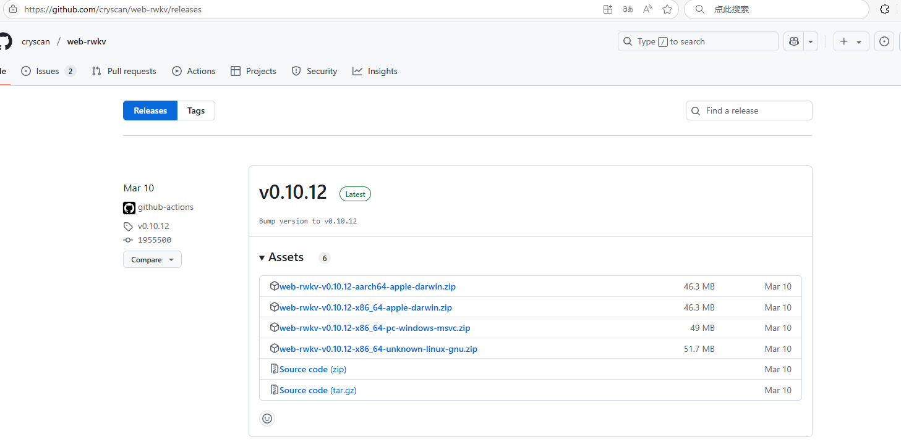
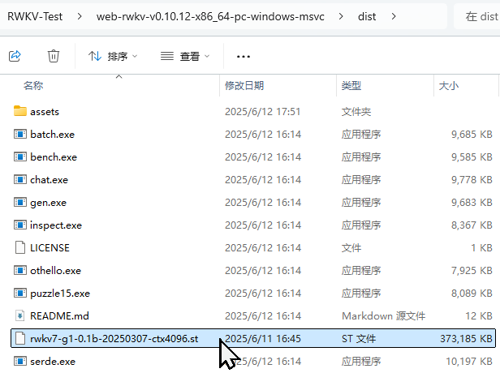
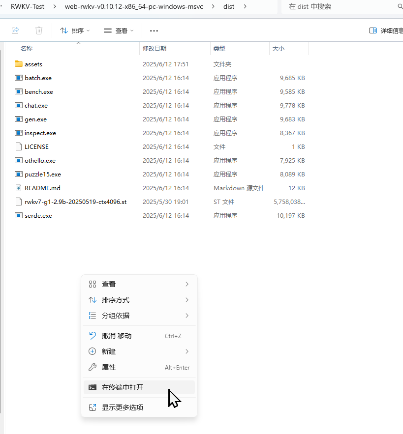

# RWKV 推理性能测试指南

**Language / 语言:** 🇨🇳 中文 | [🇺🇸 English](./README_EN.md)

本指南将帮助您快速设置和测试 RWKV 模型的推理性能，提供两种不同的测试。

## 📋 目录

- [准备工作](#准备工作)
- [测试一：web-rwkv 性能基准测试](#🔧-测试一web-rwkv-性能基准测试)
  - [安装步骤](#📦-安装步骤)
  - [性能测试](#⚡-性能测试)
  - [测试结果解读](#📊-测试结果解读)
- [测试二：RWKVpip 交互式测试](#🐍-测试二rwkvpip-交互式测试)
  - [环境准备](#📋-环境准备)
  - [配置与运行](#⚙️-配置与运行)
- [注意事项](#⚠️-注意事项)

## 🚀 准备工作

在开始之前，请确保：

- 系统具备足够的存储空间用于下载模型文件
- 具备基本的命令行操作能力
- 已安装 Python 环境（测试二需要）

## 🔧 测试一：web-rwkv 性能基准测试

### 📦 安装步骤

#### 1. 下载 web-rwkv 工具

访问 [web-rwkv releases](https://github.com/cryscan/web-rwkv/releases) 页面，下载适合您操作系统的最新版本压缩包。



下载完成后，将压缩包解压到您选择的目录中。

#### 2. 获取 RWKV 模型

前往 [RWKV-ST-model](https://huggingface.co/shoumenchougou/RWKV-ST-model/tree/main) 仓库，下载所需的 `.st` 格式 RWKV 模型文件。


#### 3. 配置模型路径

将下载的模型文件移动到 web-rwkv 解压目录下的 `dist` 文件夹中：



### ⚡ 性能测试

#### 打开终端

首先在解压后的文件夹的 `dist` 目录下，右键选择"在集成终端中打开"：



然后分别输入以下指令，进行不同量化程度的测试：

#### 基础测试（无量化）

运行以下命令进行基础性能测试：

```bash
./bench.exe --model "path-to/rwkv7-g1-2.9b-20250519-ctx4096.st"
```

#### INT8 量化测试

使用 INT8 量化可以减少内存使用并提升推理速度：

```bash
./bench.exe --model "path-to/rwkv7-g1-2.9b-20250519-ctx4096.st" --quant 31
```

**参数说明：**

- `--quant`: 设置量化层数，数值越大量化程度越高

#### NF4 量化测试

NF4 量化提供更激进的压缩选项：

```bash
./bench.exe --model "path-to/rwkv7-g1-2.9b-20250519-ctx4096.st" --quant-nf4 31
```

### 📊 测试结果解读

测试完成后，您将看到包含以下信息的性能报告：


**结果说明：**

- **t/s**: 表示推理速度（tokens/秒），数值越高性能越好
- **其他列**: 包含模型基本信息，如模型名称、INT8 量化层数、NF4 量化层数以及测试内容

这些数据将帮助您评估 RWKV 模型在不同量化设置下的性能表现，选择最适合您需求的配置。

## 🐍 测试二：RWKVpip 交互式测试

这种方法适合希望通过 Python 代码直接测试模型性能的用户。

### 📋 环境准备

#### 1. 打开终端

在 `API_DEMO_CHAT.py` 文件的同级目录下，右键选择"在终端中打开"：


#### 2. 安装依赖包

运行以下命令安装必要的 Python 包：

```bash
# 安装 PyTorch (支持 CUDA 12.1)
pip install torch --upgrade --extra-index-url https://download.pytorch.org/whl/cu121

# 安装 RWKV 相关依赖
pip install rwkv psutil prompt_toolkit tokenizers
```

### ⚙️ 配置与运行

#### 3. 参数配置

在 `API_DEMO_CHAT.py` 文件中需要调整以下关键参数：

| 参数名称 | 功能描述 | 可选值 | 说明 |
|---------|---------|--------|------|
| `args.strategy` | 运行设备和精度 | `cuda fp16`<br>`cpu fp16`<br>`cuda fp32` | 推荐使用 `cuda fp16` 获得最佳性能 |
| `args.MODEL_NAME` | 模型文件路径 | 模型文件的完整路径 | 仅需要输入模型名，不需要输入后缀，但此处需要 `.pth` 格式的模型 |

**配置示例：**

```python
args.strategy = 'cuda fp16'  # 使用 GPU 和半精度浮点
args.MODEL_NAME = '/path/to/your/rwkv-model'
```

#### 4. 启动测试

配置完成后，在终端中运行以下命令启动模型：

```bash
python API_DEMO_CHAT.py
```

程序启动后，您可以通过交互式聊天界面测试模型的响应速度和质量。

## ⚠️ 注意事项

- **路径格式**: 命令中的模型路径必须保留引号
- **量化限制**: 量化层数不能超过模型的实际层数
- **文件路径**: 请根据实际的模型文件位置调整路径参数
- **GPU 支持**: 测试二需要 CUDA 支持以获得最佳性能
- **模型格式**: 两种方法支持不同的模型格式（`.st` vs `.pth`）

## 🙏 致谢

感谢以下开发者和项目为本指南提供的支持：

- [@BlinkDL](https://github.com/BlinkDL) - RWKV 架构的创建者
- [@cryscan](https://github.com/cryscan) - [web-rwkv](https://github.com/cryscan/web-rwkv) 项目的开发者
- [@shoumenchougou](https://github.com/shoumenchougou) - 提供了预训练模型的仓库

特别感谢 RWKV 开源社区的所有贡献者，让这个优秀的语言模型架构得以不断发展和完善。

---

*本指南持续更新中，如有问题或建议，欢迎提交 Issue 或 Pull Request。*